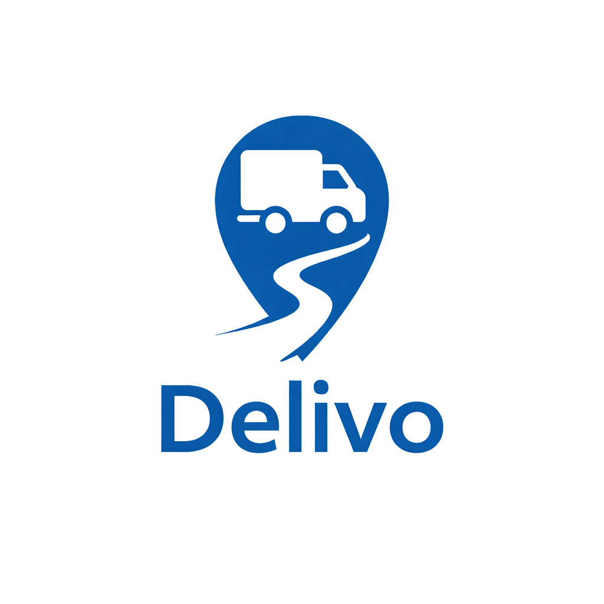

<div align="center">
  

  <h1>Delivo</h1>

  <p><strong>A mobile app for small businesses to manage sales and expenses and plan delivery routes.</strong></p>

  <p>
    
    
    
    
    
  </p>
</div>

---

## About

Delivo helps small business owners and independent sellers run their day-to-day operations from their phone. It keeps clients, products, orders and bills in one place, shows how income is trending, and plans optimized delivery routes on a map.

The app launches in Spanish for the Latin American market, and an English translation is also included.

## Features

- **Multiple companies**: manage more than one business from the same account and switch between them.
- **Clients, products & orders**: full CRUD with client profiles, a product catalog, and an order creation flow.
- **Bills & payment methods**: track customer bills and the payment methods you accept.
- **Financial dashboard**: income summaries and trend charts.
- **Delivery routes**: build routes from orders and view them on interactive Mapbox maps with polyline paths and live location.
- **Guided onboarding**: a 5-step wizard after signup (company → product → client → order → route) that you can skip and resume.
- **Authentication**: Google and Apple sign-in, with tokens stored in the device's secure storage.
- **Subscriptions**: in-app "Pro" plan (monthly and yearly) through RevenueCat.
- **Polished UX**: haptic feedback, swipe actions, skeleton loaders, toasts, and light/dark theming.
- **OTA updates & force-update**: EAS Update for over-the-air releases and a force-update screen for outdated versions.

## Tech Stack

| Area | Technologies |
| --- | --- |
| **Core** | [Expo SDK 56](https://expo.dev) (New Architecture, React Compiler), React Native 0.85, React 19, TypeScript 5.9 |
| **Navigation** | Expo Router (file-based routing, typed routes) |
| **UI & Animation** | React Native Reanimated 4, Gesture Handler, react-native-svg, expo-image, expo-haptics |
| **Maps & Location** | @rnmapbox/maps, @mapbox/polyline, expo-location |
| **Data & State** | Axios, Zod, React Context, AsyncStorage, NetInfo |
| **Auth & Security** | expo-auth-session (Google), expo-apple-authentication, expo-secure-store |
| **Monetization** | RevenueCat (`react-native-purchases`, `react-native-purchases-ui`) |
| **i18n** | i18next, react-i18next, expo-localization, Moment.js |
| **Monitoring & Delivery** | Sentry, EAS Build, EAS Update |
| **Tooling** | ESLint (`eslint-config-expo`) |

## Project Structure

```
app/          Screens and navigation (Expo Router, file-based)
  (tabs)/     Main tabs: home, orders, clients, products, routes, bills, account
  onboarding/ Post-signup wizard
components/   Reusable UI and domain components (orders, clients, maps, financial…)
context/      App-wide state: Auth, Companies, Routes, Purchases, Toasts, Onboarding
hooks/        Data-fetching and device hooks (useOrders, useClients, useUserLocation…)
services/     API client (Axios) and domain services (auth, orders, routes, stats…)
types/        Shared TypeScript type declarations
i18n/         Translations (es, en)
constants/    Colors, theme, and route constants
```

Imports use the `@/` path alias, which maps to the project root (for example `@/components`, `@/services`).

## Getting Started

### Prerequisites

- Node.js 20+
- Xcode (iOS) and/or Android Studio (Android)
- A [Mapbox](https://www.mapbox.com) account and a [RevenueCat](https://www.revenuecat.com) project

> **Note:** The app uses native modules (Mapbox, RevenueCat) that **Expo Go** doesn't support, so you need a development build.

### Setup

```bash
# 1. Install dependencies
npm install

# 2. Configure environment variables
cp .env.example .env
# then fill in API_URL, EXPO_PUBLIC_MAPBOX_ACCESS_TOKEN, MAPBOX_DOWNLOADS_TOKEN,
# EXPO_PUBLIC_REVENUECAT_IOS_KEY / _ANDROID_KEY, and the store URLs

# 3. Build and run a development client
npm run ios       # or: npm run android

# 4. Start the dev server (after the dev client is installed)
npm start
```

### Scripts

| Command | Description |
| --- | --- |
| `npm start` | Start the Expo dev server |
| `npm run ios` | Build and run on iOS simulator or device |
| `npm run android` | Build and run on Android emulator or device |
| `npm run web` | Start the web build |
| `npm run lint` | Lint the project with ESLint |

## Author

**Aaron Santana** · [@Santaval](https://github.com/Santaval)
